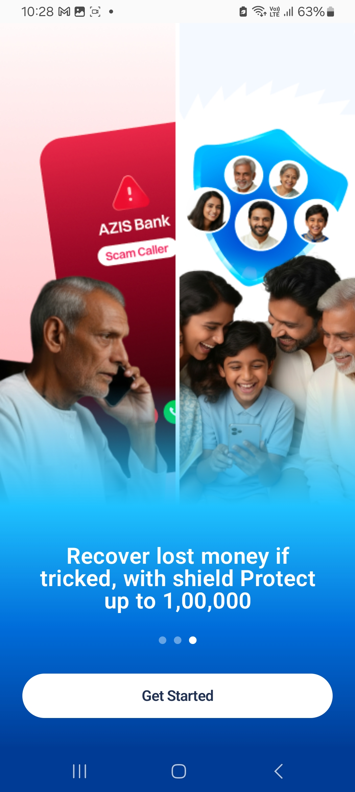
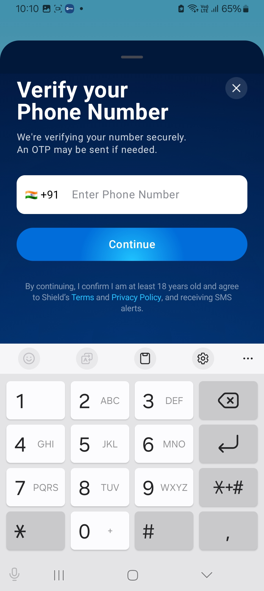
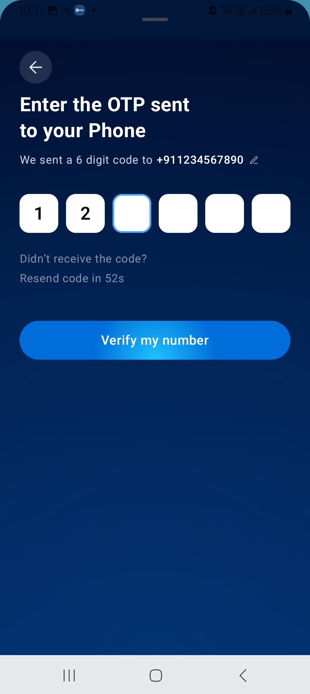
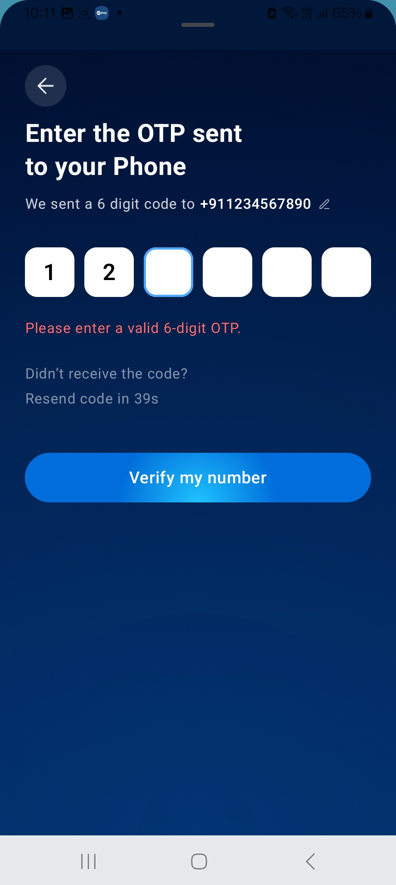
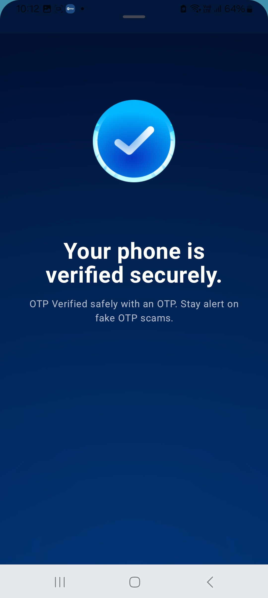

# SpaceKayak Android Assignment

A modern Android application that demonstrates a smooth onboarding flow with OTP verification using Jetpack Compose.

## 🚀 Features

- Onboarding screens with smooth animations
- Phone number input with country code selection
- OTP verification with auto-fill support
- Loading states and error handling
- Modern UI with animations and transitions

## 🛠️ Prerequisites

- Android Studio Giraffe | 2022.3.1 or later
- Android SDK 34
- Kotlin 1.8.0 or later
- Gradle 8.0 or later

## 🔧 Installation

1. Clone the repository:
   ```bash
   git clone https://github.com/KanhaiyaKumarShukla/Spacekayak-Android-Assignment.git
   ```

2. Open the project in Android Studio

3. Sync the project with Gradle files

4. Run the app on an emulator or physical device

## 📱 Screenshots

### Welcome Onboarding
<div style="display: flex; flex-wrap: wrap; gap: 16px;">
  
  
  
</div>

### OTP Verification Flow
<div style="display: flex; flex-wrap: wrap; gap: 16px;">
  
  
  
  
</div>

## 🏗️ Architecture

The app follows Clean Architecture principles with MVVM pattern:
- **UI Layer**: Jetpack Compose for modern declarative UI
- **Presentation Layer**: ViewModel to handle UI logic
- **Domain Layer**: Use cases and business logic
- **Data Layer**: Repository pattern for data management

## 📦 Dependencies

- **Jetpack Compose** - Modern UI toolkit
- **ViewModel** - Manage UI-related data
- **Coroutines** - Asynchronous programming
- **Navigation Compose** - Navigation between screens
- **Material 3** - Modern Material Design components


## 👨‍💻 Author

Kanhaiya Kumar

